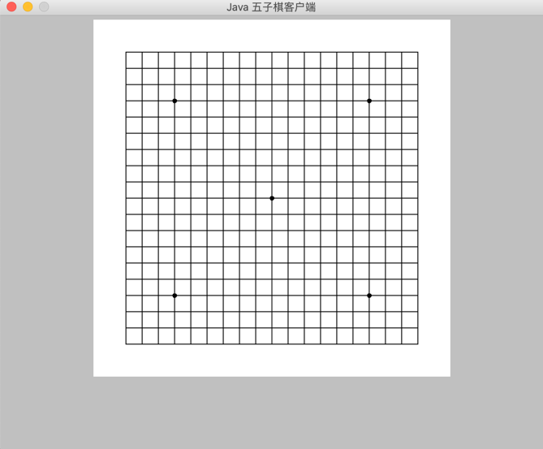
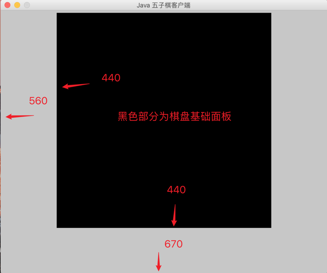
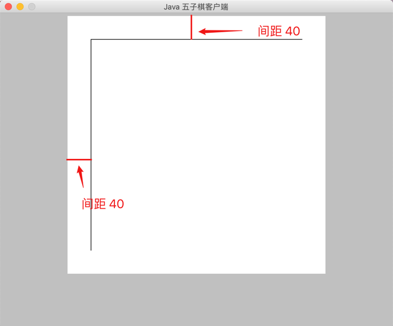
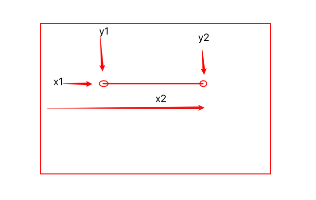
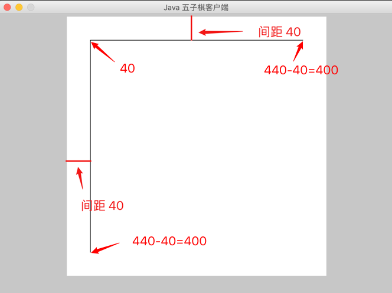
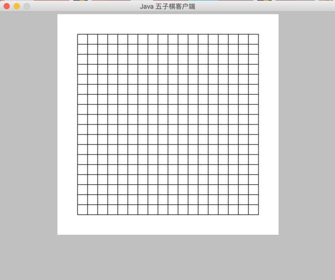
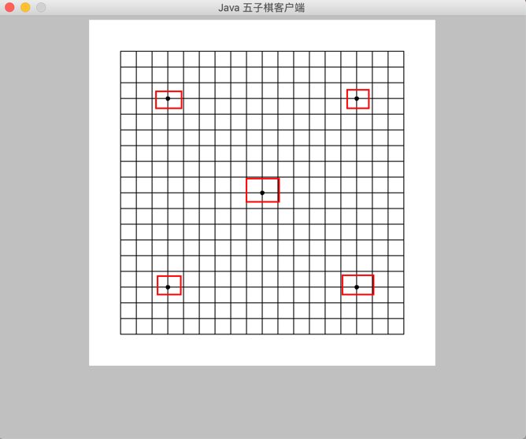
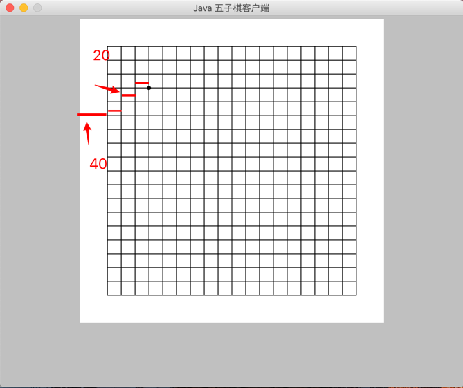
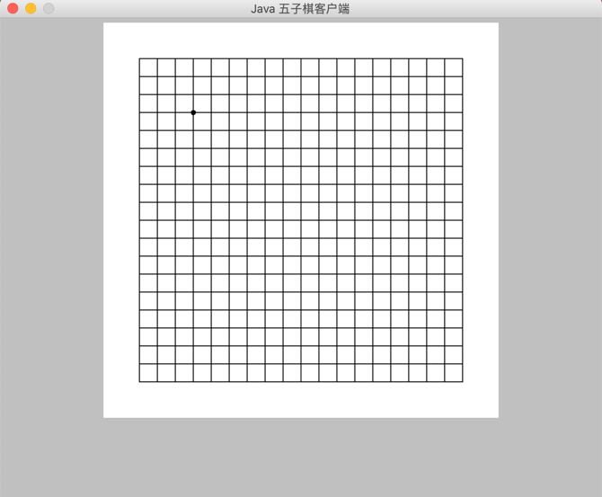

# 画出五子棋棋盘



## 目标

```
画出如上图所示的棋盘
上一个步骤我们已经定义好了大小为 670 * 560 的基础面板
接下来我们需要在基础面板中定义面板大小为 440 * 440 的棋盘
```

## 画出棋盘布局



### 操作方法

在 FIRPad 类的 FIRPad 中 定义画布大小

```
 setSize(440, 440);
```

为了方便演示将棋盘画布颜色设置成白色

```
 setBackground(Color.WHITE);
```

## 画出棋盘网格


为了使棋盘在棋盘面板中的中间位置所以左右上下各减 40 画出两条线



### 操作方法

在 FIRPad 类的 paint 方法中实现

g.drawLine(int x1, int y1, int x2, int y2)

参数：
- x1–第一个点的x坐标。
- y1–第一个点的y坐标。
- x2–第二个点的x坐标。
- y2–第二个点的y坐标。



可以根据上图表示坐标系的位置



根据上图中的我们的画布可以得到

- 横线 x1 = 40 , y1 = 40 , x2 = 400 , y2 = 40

- 竖线 x1 = 40 , y1 = 40 , x2 = 40 , y2 = 400

即:

```
       g.drawLine(40, 40, 400, 40);
       g.drawLine(40, 40, 40, 400);
```


根据上面步骤的原理我们可以按照 20 * 20 的大小方格画出整个棋盘

```
        g.drawLine(40, 40, 400, 40);
        g.drawLine(40, 60, 400, 60);
        g.drawLine(40, 80, 400, 80);
        g.drawLine(40, 100, 400, 100);
        g.drawLine(40, 120, 400, 120);
        g.drawLine(40, 140, 400, 140);
        g.drawLine(40, 160, 400, 160);
        g.drawLine(40, 180, 400, 180);
        g.drawLine(40, 200, 400, 200);
        g.drawLine(40, 220, 400, 220);
        g.drawLine(40, 240, 400, 240);
        g.drawLine(40, 260, 400, 260);
        g.drawLine(40, 280, 400, 280);
        g.drawLine(40, 300, 400, 300);
        g.drawLine(40, 320, 400, 320);
        g.drawLine(40, 340, 400, 340);
        g.drawLine(40, 360, 400, 360);
        g.drawLine(40, 380, 400, 380);
        g.drawLine(40, 400, 400, 400);

```


由上面代码可以看出每画一条线  `g.drawLine(int x1, int y1, int x2, int y2)` 的第二,四参数 (y1,y2) 分别加 20 的高度

所以上代码可以简化成一个 `for` 循环


```
    for (int i = 40; i <= 400; i = i + 20) {
         g.drawLine(40, i, 400, i);
    }
```


 同理画出竖线

```
        for (int j = 40; j <= 400; j = j + 20) {
            g.drawLine(j, 40, j, 400);
        }

```
### 运行效果




## 画出五个中心点

我们需要在如下图划红线出所示的地方画出五个大小为 6 * 6 的圆点



### 操作方法

使用 `g.fillOval(int x, int y, int width, int height)` 方法可以画出圆点

参数 x 和 y 分别代表横坐标的位置和纵坐标的位置
width 和 height 分别代表圆点的宽度和高度

所以我们找到五个点的坐标位置就可以很轻松的画出这五个点



找到第一个点的位置, 根据上面的步骤我们知道: 第一条竖线距离五子棋基础面板的距离为 40 ,每个格子的宽度是 20
一共三个格子 所以我们通过计算:
横坐标 (x) 40 + 20 + 20 + 20 = 100 
纵坐标 (y) 40 + 20 + 20 + 20 = 100

那么:

```
g.fillOval(100, 100, 6, 6)
```
就可以画出圆点了吗?

执行结果如下图:


#### 问题

圆点跑偏了? 为什么呢?


这是因为圆点本身也是有宽度和高度的, 这里我们给的宽度和高度都是 6 所以我们要减掉宽度和高度的一半就可以让圆点在两条线的中间了 !


```
g.fillOval(97, 97, 6, 6)
```

再次执行结果如下图:




同理可以画出另外四个圆点

```
        g.fillOval(97, 97, 6, 6);
        g.fillOval(337, 97, 6, 6);
        g.fillOval(97, 337, 6, 6);
        g.fillOval(337, 337, 6, 6);
        g.fillOval(217, 217, 6, 6);
```

### 运行效果

运行结果如下:


