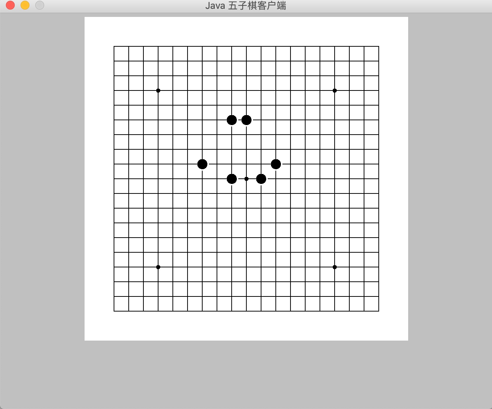
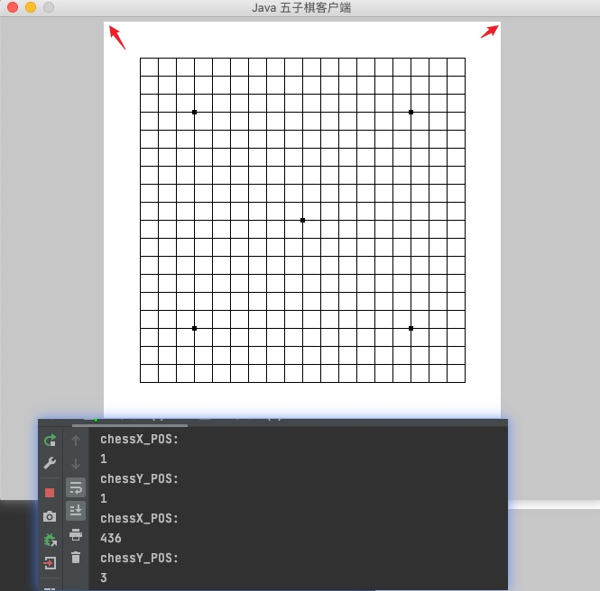
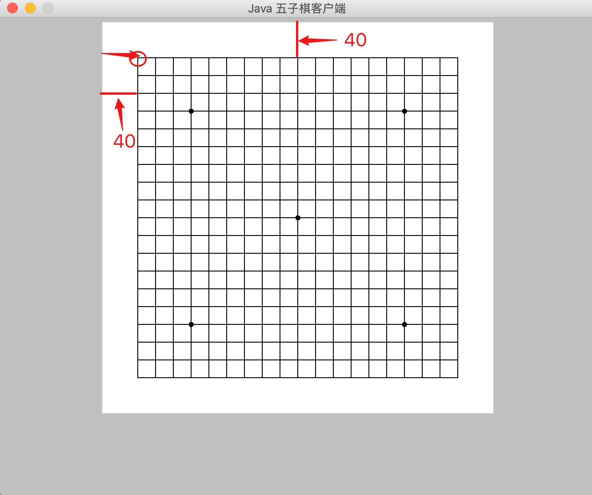

# 画棋子

## 目标

```
在上一个步骤中我们已经划出了五子棋的棋盘
接下来我们需要在棋盘中, 通过点击鼠标画出棋子
```



## 思路

### 获取鼠标在棋盘中的点击事件


在 FIRPad 类中实现 MouseListener 接口中的 mouse* 方法


```

public class FIRPad extends Panel implements MouseListener{
    @Override
    public void mousePressed(MouseEvent e) {
    }
    @Override
    public void mouseReleased(MouseEvent e) {
    }
    @Override
    public void mouseEntered(MouseEvent e) {
    }
    @Override
    public void mouseExited(MouseEvent e) {
    }
    @Override
    public void mouseClicked(MouseEvent e) {
    }
```

在 mousePressed 实现鼠标在棋盘中点击后的操作


### 获取点击的 X Y 坐标位置

通过 public void mousePressed(MouseEvent e) MouseEvent e 可以获取到 X 坐标和 Y 坐标

```
    // 获取鼠标点击的 X 坐标
    chessX_POS =  e.getX();
    // 获取鼠标点击的 Y 坐标
    chessY_POS =  e.getY();
    
    System.out.println("chessX_POS:");
    System.out.println(chessX_POS);
    System.out.println("chessY_POS:");
    System.out.println(chessY_POS);
    
```
获取到的chessX_POS, chessY_POS 是当前鼠标在整个棋盘布局中的坐标 



如上图所示:

我们可以看到, 尽管我们已经尽可能的点击左上角和右上角,
但实际程序获取到的 X ,Y 坐标还不是 (0,0) 和 (440,0)
所以为了更精确的匹配到五子棋的位置, 我们还需要对坐标系进行取整处理 

### 坐标取整处理


因为鼠标点击棋盘会有一些偏移量, 为了使棋子能在两条线的交叉处, 所以我们需要对坐标系取整处理
每个格子的大小是 20 * 20 所以需要除以 20
为了使 X 和 Y 向下取整后坐标更精确, 我们在 X 和 Y 坐标中分别加上半个格子的大小 10

```
int a = (chessX_POS + 10 ) / 20, b = (chessY_POS + 10) / 20;

System.out.println(a);
System.out.println(b);
```



因为上下左右各占了 40 
所以当我们点击棋盘中网格的最左上角时的取整后坐标应该为
(2,2) 
相当于横向第二个格子, 纵向第二个格子
点击其他网格位置同理
这样我们就可以根据当前是第几个格子来画出棋子
相当于把鼠标的 X,Y 的坐标系转化为棋盘中格子的数量了


注意: 当点击左右上下的空白位置时是不需要画出棋子的, 根据网格数量可以用如下代码判断

```
// 判断当前坐标是否越界了
if (chessX_POS / 20 < 2 || chessY_POS / 20 < 2 || chessX_POS / 20 > 19 || chessY_POS / 20 > 19) {
    // 下棋位置不正确时，不执行任何操作
} else {
    // 画棋子
  
}
```
### 创建棋子画布

定义 FIRPointBlack 类 继承 Canvas 并重写 paint() 方法 来定义棋子画布

```
public class FIRPointBlack extends Canvas {
   @Override
   public void paint(Graphics g) {
	}
```

设置棋子颜色为 black
设置棋子大小为 14 * 14

```
   /**
     * 画棋子
     * @param g
     */
    @Override
	public void paint(Graphics g) {
        // 设置棋子颜色
        g.setColor(Color.black);
        // 设置棋子大小
        g.fillOval(0, 0, 14, 14);
    }
```


### 画出棋子

定义一个方法 传入横向纵向格子的数量 xPos yPos 和当前棋子的颜色 chessColor

```
public void paintFirPoint(int xPos, int yPos, int chessColor) {

```


需要将格子的数量转化为坐标值
所以 xPos 和 yPos 需要乘以网格的大小 20 算出坐标系

因为每个棋子的大小是 14 * 14
要把棋子放到两条线的中心点所以 xPos 和 yPos 乘以网格的大小 20之后还需要减掉 7

```
// 最后两个参数的 16 是棋子所占块的大小 
        firPBlack.setBounds(xPos * 20 - 7, yPos * 20 - 7, 16, 16);
```

最终运行效果如下:


### 思考

- 如何画出白色棋子?
- 如何黑白棋子交替画出?


