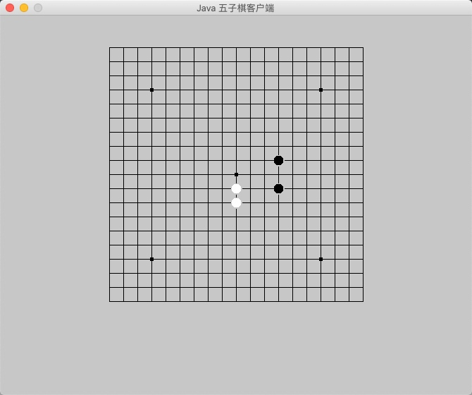
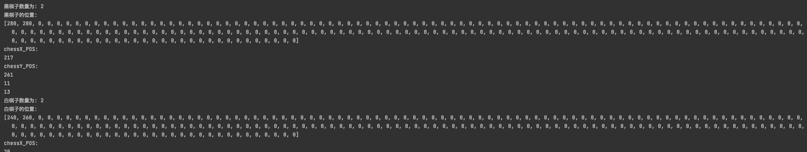

# 画出白棋子并记录黑棋子和白棋子的位置和数量

## 目标
```
画出白棋子并记录黑棋子和白棋子的位置和数量
```






### 如何画出白色棋子

上一章节中我们已经画出了黑棋子
根据相同原理即可创建黑棋子画布

根据类`FIRPointBlack`创建类 `FIRPointWhite` 
将 `public void paint(Graphics g)` 中的颜色改为白色即可
```
    @Override
    public void paint(Graphics g) { // 画棋子
        g.setColor(Color.white);
        g.fillOval(0, 0, 14, 14);
    }
```

在 `FIRPad`类中 `public void paintFirPoint(int xPos, int yPos, int chessColor) {`

```
 FIRPointWhite firPWhite = new FIRPointWhite();
 this.add(firPWhite);
 firPWhite.setBounds(xPos * 20 - 7, yPos * 20 - 7, 16, 16);
 ```
 即可画出白色棋子
 
 
 ### 如何黑白棋子交替画出
 
 在 FIRPad 类中定义属性 chessColor (棋子的颜色),
 我们假设 1 为黑色, -1 为白色
 ```
 	/**
	 *	棋子的颜色
	 */
    public int chessColor = 1;
 ```
 
 当画出黑色棋子后修改下一次棋子颜色为白色 `-1`
 
 ```
 if (chessColor == 1){
    this.chessColor = -1;
 }else{
    this.chessColor = 1;
 }
 ```
 
 上面的代码再加上画棋子操作, 就可以实现黑白棋子交替画出了
 
 ### 记录黑棋子和白棋子的位置和数量
 
 现在我们已经可以黑白棋子交替画出了
 接着我们定义一个方法, 来记录黑棋子或白棋子的位置
 
 记录位置的方法需要两个参数 X 坐标和 Y 坐标, 除此之外还需要一个颜色的参数来记录是黑棋子还是白棋子
 ```
 public void setLocation(int xPos, int yPos, int chessColor) {
 ```
 
 那么记录到哪呢, 我们需要每个颜色棋子分别定义两个数组变量来记录X 和Y的值
 
 ```
 	/**
	 *	黑棋x轴坐标位数组
	 */
    public int chessBlack_XPOS[] = new int[200];
	/**
	 *	黑棋y轴坐标位数组
	 */
    public int chessBlack_YPOS[] = new int[200];
	/**
	 *	白棋x轴坐标位数组
	 */
    public int chessWhite_XPOS[] = new int[200];
	/**
	 *	白棋y轴坐标位数组
	 */
    public int chessWhite_YPOS[] = new int[200];
 ```
 
 这样我们根据当前的棋子颜色就可以记录下来当前的棋子所在的坐标系
 
 ```
 	/**
	 * 取得指定棋子的位置
	 * @param xPos
	 * @param yPos
	 * @param chessColor
	 */
    public void setLocation(int xPos, int yPos, int chessColor) {
        // 棋子为黑棋时
        if (chessColor == 1) {
            chessBlack_XPOS[chessBlackCount] = xPos * 20;
            chessBlack_YPOS[chessBlackCount] = yPos * 20;
            chessBlackCount++;
            System.out.println("黑棋子数量为: " + chessBlackCount);
            System.out.println("黑棋子的位置: ");
            System.out.println(Arrays.toString(chessBlack_XPOS));
            // 棋子为白棋时
        } else if (chessColor == -1) {
            chessWhite_XPOS[chessWhiteCount] = xPos * 20;
            chessWhite_YPOS[chessWhiteCount] = yPos * 20;
            chessWhiteCount++;
            System.out.println("白棋子数量为: " + chessWhiteCount);
            System.out.println("白棋子的位置: ");
            System.out.println(Arrays.toString(chessWhite_YPOS));
        }
    }
 ```
 
 运行结果:
 
 


### 思考

黑棋子有了, 白棋子也有了, 位置信息也有了
如何判断胜出呢?
