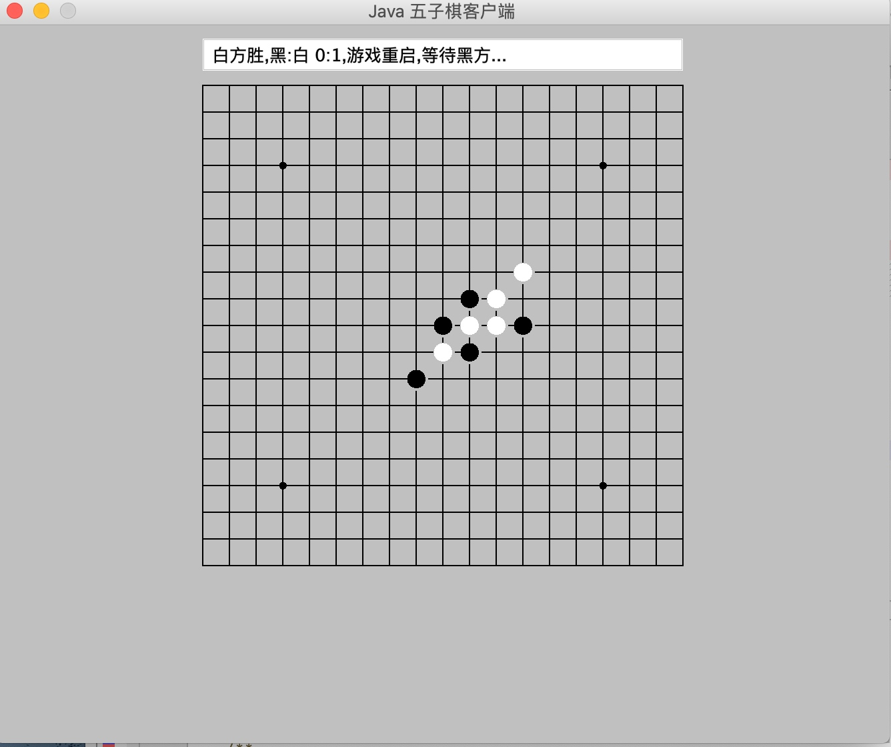
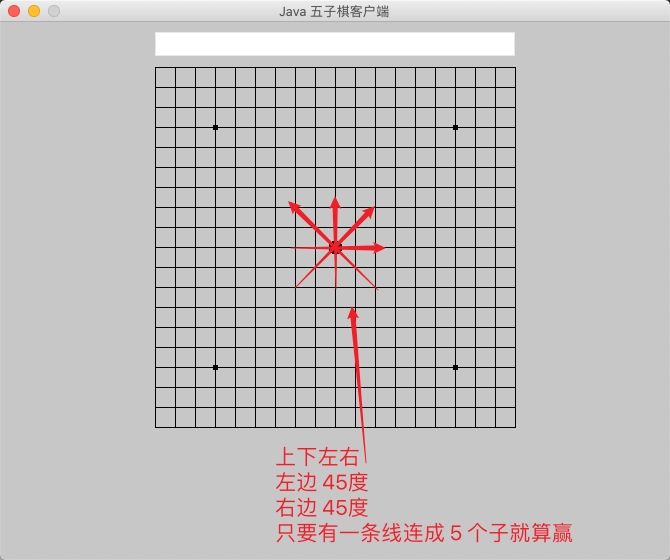
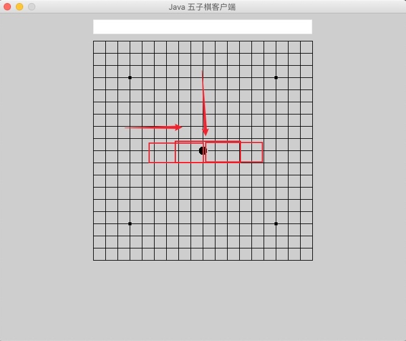
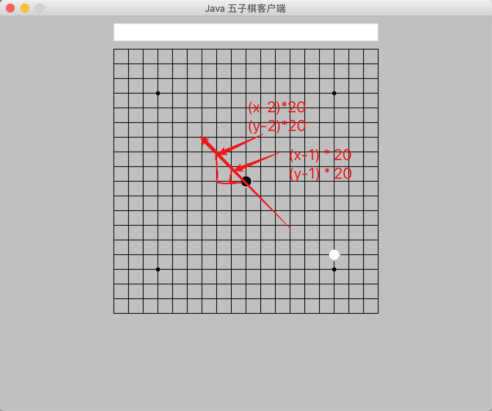
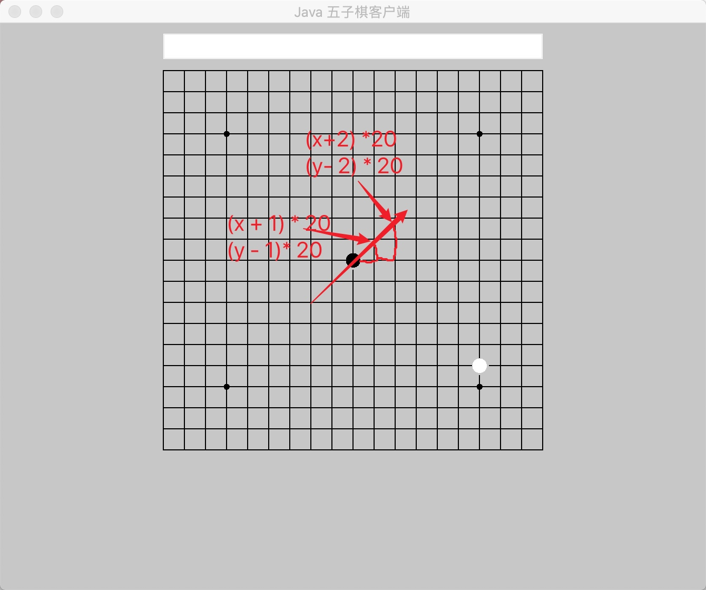

# 判断输赢

## 目标

```
可以判断出黑白棋输赢状态
记录并显示输赢次数(比分)
```




### 判断胜出

#### 胜出条件


   想要判断胜出, 首先要了解五子棋的胜出条件
   
   

如上图所示:

左右上下,左上右下,右上左下, 只要有一条线连成 5 个子就算胜出


上一章节中我们已经将黑棋子和白棋子的坐标系记了下来, 现在只要找到规律判断出这四个方向的棋子是否有连续五个相同颜色就可以判断出是否胜出了    
    
#### 思路  
  
##### 判断左右方向的黑色棋子
  
  

  
如上图所示


判断左右方向的棋子, 以当前的棋子为开始, 纵坐标 Y 不变 , X 坐标加减(+右,-左) n 的值 * 20 (n 代表格子的个数) 


右边:
  分别判断右边的最多四个(小于等于4)棋子是否为连续黑色
  记录最多连续黑色个数
  如果连续个数为 5 则胜出
  
左边: 
  分别判断左边的最多(小于等于4)四个棋子是否为连续黑色
  记录连续黑色个数加上右边最多连续个数
  如果相加的连续个数为 5 则胜出
  
根据以上判断逻辑我们可以定义方法 `public boolean checkVicStatus(int xPos, int yPos, int chessColor) `
来判断是否胜出

```
 public boolean checkVicStatus(int xPos, int yPos, int chessColor) {
        // 连接棋子数
        int chessLinkedCount = 1;
        // 用于比较是否要继续遍历一个棋子的相邻网格
        int chessLinkedCompare = 1;
        // 要比较的棋子在数组中的索引位置
        int chessToCompareIndex = 0;
        // 相邻网格的位置
        int closeGrid = 1;
        // 黑棋时
        if (chessColor == 1) {
            // 将该棋子自身算入的话，初始连接数为1
            chessLinkedCount = 1;
            //以下每对for循环语句为一组，因为下期的位置能位于中间而非两端
            // 遍历相邻4个网格
            for (closeGrid = 1; closeGrid <= 4; closeGrid++) {
                // 遍历棋盘上所有黑棋子
                for (chessToCompareIndex = 0; chessToCompareIndex <= chessBlackCount; chessToCompareIndex++) {
                    // 判断当前下的棋子的右边4个棋子是否都为黑棋
                    if (((xPos + closeGrid) * 20 == chessBlack_XPOS[chessToCompareIndex])
                            && ((yPos * 20) == chessBlack_YPOS[chessToCompareIndex])) {
                        // 连接数加1
                        chessLinkedCount = chessLinkedCount + 1;
                        // 五子相连时，胜利
                        if (chessLinkedCount == 5) {
                            return true;
                        }
                    }
                }
                if (chessLinkedCount == (chessLinkedCompare + 1)) {
                    chessLinkedCompare++;
                } else {
                    // 若中间有一个棋子非黑棋，则会进入此分支，此时无需再遍历
                    break;
                }
            }
            for (closeGrid = 1; closeGrid <= 4; closeGrid++) {
                // 遍历棋盘上所有黑棋子
                for (chessToCompareIndex = 0; chessToCompareIndex <= chessBlackCount; chessToCompareIndex++) {
                    // 判断当前下的棋子的左边4个棋子是否都为黑棋
                    if (((xPos - closeGrid) * 20 == chessBlack_XPOS[chessToCompareIndex])
                            && (yPos * 20 == chessBlack_YPOS[chessToCompareIndex])) {
                        chessLinkedCount++;
                        if (chessLinkedCount == 5) {
                            return true;
                        }
                    }
                }
                if (chessLinkedCount == (chessLinkedCompare + 1)) {
                    chessLinkedCompare++;
                } else {
                    break;
                }
            }
        }
    }
```
  

    
##### 判断上下方向的黑色棋子
  
  


如上图所示:

判断上下方向的棋子, 以当前的棋子为开始, 纵坐标 X 不变 , Y 坐标 加减(+下,-上) n 的值 * 20 (n 代表格子的个数) 

下边:
  分别判断下边的最多四个(小于等于4)棋子是否为连续黑色
  记录最多连续黑色个数
  如果连续个数为 5 则胜出
  
上边: 
  分别判断上边的最多(小于等于4)四个棋子是否为连续黑色
  记录连续黑色个数加上下边最多连续个数
  如果相加的连续个数为 5 则胜出

```
 // 进入新的一组for循环时要将连接数等重置
            chessLinkedCount = 1;
            chessLinkedCompare = 1;
            for (closeGrid = 1; closeGrid <= 4; closeGrid++) {
                for (chessToCompareIndex = 0; chessToCompareIndex <= chessBlackCount; chessToCompareIndex++) {
                    // 判断当前下的棋子的上边4个棋子是否都为黑棋
                    if ((xPos * 20 == chessBlack_XPOS[chessToCompareIndex])
                            && ((yPos + closeGrid) * 20 == chessBlack_YPOS[chessToCompareIndex])) {
                        chessLinkedCount++;
                        if (chessLinkedCount == 5) {
                            return true;
                        }
                    }
                }
                if (chessLinkedCount == (chessLinkedCompare + 1)) {
                    chessLinkedCompare++;
                } else {
                    break;
                }
            }
            for (closeGrid = 1; closeGrid <= 4; closeGrid++) {
                for (chessToCompareIndex = 0; chessToCompareIndex <= chessBlackCount; chessToCompareIndex++) {
                    // 判断当前下的棋子的下边4个棋子是否都为黑棋
                    if ((xPos * 20 == chessBlack_XPOS[chessToCompareIndex])
                            && ((yPos - closeGrid) * 20 == chessBlack_YPOS[chessToCompareIndex])) {
                        chessLinkedCount++;
                        if (chessLinkedCount == 5) {
                            return true;
                        }
                    }
                }
                if (chessLinkedCount == (chessLinkedCompare + 1)) {
                    chessLinkedCompare++;
                } else {
                    break;
                }
            }
```
 
##### 判断左上右下方向的黑色棋子 
 


根据相同原理可以判断左上右下方向的棋子,以当前的棋子为开始, X 坐标加减(+下,-上) n 的值 * 20 (n 代表格子的个数) Y 坐标 加减(+下,-上) n 的值 * 20 (n 代表格子的个数) 
 20 
 
 



    


```
            chessLinkedCount = 1;
            chessLinkedCompare = 1;
            for (closeGrid = 1; closeGrid <= 4; closeGrid++) {
                for (chessToCompareIndex = 0; chessToCompareIndex <= chessBlackCount; chessToCompareIndex++) {
                    // 判断当前下的棋子的左上方向4个棋子是否都为黑棋
                    if (((xPos - closeGrid) * 20 == chessBlack_XPOS[chessToCompareIndex])
                            && ((yPos + closeGrid) * 20 == chessBlack_YPOS[chessToCompareIndex])) {
                        chessLinkedCount++;
                        if (chessLinkedCount == 5) {
                            return true;
                        }
                    }
                }
                if (chessLinkedCount == (chessLinkedCompare + 1)) {
                    chessLinkedCompare++;
                } else {
                    break;
                }
            }
            for (closeGrid = 1; closeGrid <= 4; closeGrid++) {
                for (chessToCompareIndex = 0; chessToCompareIndex <= chessBlackCount; chessToCompareIndex++) {
                    // 判断当前下的棋子的右下方向4个棋子是否都为黑棋
                    if (((xPos + closeGrid) * 20 == chessBlack_XPOS[chessToCompareIndex])
                            && ((yPos - closeGrid) * 20 == chessBlack_YPOS[chessToCompareIndex])) {
                        chessLinkedCount++;
                        if (chessLinkedCount == 5) {
                            return true;
                        }
                    }
                }
                if (chessLinkedCount == (chessLinkedCompare + 1)) {
                    chessLinkedCompare++;
                } else {
                    break;
                }
            }
```


##### 判断右上左下方向的黑色棋子 

判断右上左下方向的黑色棋子与左上右下方向的原理相同, 只不过把方向反过来了




##### 练习

根据上面相同原理, 判断白棋胜利


### 记录黑方胜利次数和白方胜利次数

定义方法 `public void setVicStatus(int vicChessColor)`来记录胜利次数 

首先定义两个属性来计数

```
    /**
     * 黑棋获胜次数
     */
    public int chessBlackVicTimes = 0;
    /**
     * 白棋获胜次数
     */
    public int chessWhiteVicTimes = 0;
```

当 vicChessColor 为黑棋的时候 `chessBlackVicTimes ++`
当 vicChessColor 为白棋的时候 `chessBlackVicTimes ++`

写成 Java 代码 
```
        // 黑棋胜
        if (vicChessColor == 1) {
            chessBlackVicTimes++;

            // 白棋胜
        } else if (vicChessColor == -1) {
            chessWhiteVicTimes++;
 
        }
```


### 创建头部文本框显示当前输赢状态


定义头部全局文本框 

```
    public TextField statusText = new TextField("");
```

判断黑白棋输赢后加入文字 

```
"黑方胜,黑:白 " + chessBlackVicTimes + ":" + chessWhiteVicTimes + ",游戏重启,等待白方..."
```

```

        statusText = new TextField();
        add(statusText);
        statusText.setBounds(40, 5, 360, 24);
        // 黑棋胜
        if (vicChessColor == 1) {
            chessBlackVicTimes++;
            statusText.setText("黑方胜,黑:白 " + chessBlackVicTimes + ":" + chessWhiteVicTimes
                    + ",游戏重启,等待白方...");
            // 白棋胜
        } else if (vicChessColor == -1) {
            chessWhiteVicTimes++;
            statusText.setText("白方胜,黑:白 " + chessBlackVicTimes + ":" + chessWhiteVicTimes
                    + ",游戏重启,等待黑方...");
        }
```

### 重置棋盘

- 使用 `this.removeAll();`方法, 清空棋盘上所有棋子
- 清空已经记录的棋子位置 `chessBlack_YPOS` `chessWhite_YPOS`
- 清空棋盘上的黑棋白棋数量 `chessBlackCount` `chessWhiteCount`

```
      // 清空棋盘
        this.removeAll();

        // 将黑棋的位置设置到零点
        for (int i = 0; i <= chessBlackCount; i++) {
            chessBlack_XPOS[i] = 0;
            chessBlack_YPOS[i] = 0;
        }
        // 将白棋的位置设置到零点
        for (int i = 0; i <= chessWhiteCount; i++) {
            chessWhite_XPOS[i] = 0;
            chessWhite_YPOS[i] = 0;
        }

        // 清空棋盘上的黑棋数
        chessBlackCount = 0;
        // 清空棋盘上的白棋数
        chessWhiteCount = 0;
```

### 结束

到此为止一个简单的五子棋游戏就已经做好了

